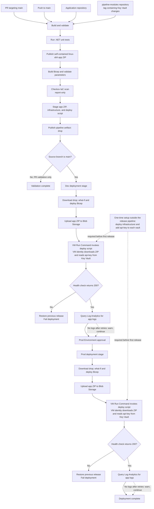

# CICD for .NET service on a Linux VM with Azure Monitor Agent

Objective
- Requirements are from [Scenario](./platform-scenario.md)
1. Build a running a .NET service on an Azure VM, with logs aggregated through the **Azure Monitor Agent (AMA)** into Log Analytics. 
[How to build and run test](./demo-saas-service-app/README.md)

2. Build and run unit tests in azure pipeline

3. Provision VM using bicep 

4. Deploy .net service into dev and prod environment

Provide a short README that explains:
- What your solution does
- How a team would use it
- Any assumptions or trade-offs


## Prerequisites

- .NET 8 SDK to build, run, and test the sample service locally.
- Azure CLI with the Bicep extension for local infrastructure validation (`az bicep install`).
- For the local Bicep commands below, clone the `pipeline-modules` repository beside this repository at `../pipeline-modules`, or adjust the paths to its location.
- An Azure subscription with the required resource providers registered and permission to deploy into pre-created dev and prod resource groups.
- An Azure DevOps project containing the application repository and a separate `pipeline-modules` Azure Repos repository. Publish a tag containing the Key Vault changes, update the app pipeline's repository `ref` to that tag, and authorize the pipeline to access it.
- Workload identity federation service connections for dev and prod, plus Azure DevOps `dev` and `prod` Environments. Configure production approvals on the `prod` Environment.

## What it provisions (per service, per environment)

```
Resource group (pre-created)
├── VNet + subnet + NSG + NAT gateway   no public IP on the VM, no internet-inbound rules
├── Ubuntu 24.04 VM (Trusted Launch)    SSH keys only, system-assigned managed identity, auto patching
│   ├── Azure Monitor Agent extension   authenticates with the VM's managed identity
│   ├── cloud-init                      unprivileged `svc` user + hardened systemd unit
│   └── DCR association                 binds the Data Collection Rule to the VM
├── Key Vault                            one per environment; RBAC, soft delete, purge protection
├── Data Collection Rule                syslog (local0 app logs, auth, daemon) + perf counters -> Log Analytics
├── Log Analytics workspace             retention parameterised (30 dev / 90 prod)
├── Storage account (releases)          shared keys disabled, Entra ID only
└── Action group + 2 alerts             no AMA heartbeat; >5 app error logs / 5 min
```

## How logs flow

```
.NET app  --stdout-->  systemd journal  --SyslogFacility=local0-->  rsyslog  -->  AMA
   -->  Data Collection Rule (filters facilities/levels)  -->  Log Analytics `Syslog` table
```

The app just writes to the console. No logging SDK, no file paths, no agent config in the
app. Query it in Log Analytics:

```kusto
Syslog
| where Facility == "local0" and ProcessName == "SaasService"
| order by TimeGenerated desc

Heartbeat | where Category == "Azure Monitor Agent" | summarize max(TimeGenerated) by Computer
Perf | where ObjectName == "Processor" | summarize avg(CounterValue) by bin(TimeGenerated, 5m)
```

## Deployment model

The VM has no inbound access, so the pipeline never SSHs in:

1. **Build**: tests, publish a *self-contained* `linux-x64` build (no .NET runtime to install or patch on the VM), Bicep lint/compile, Checkov scan.
2. **Infra**: `what-if`, then `az deployment group create`.
3. **Release**: upload `app-<buildId>.zip` to blob storage (Entra ID auth).
4. **Deploy**: `az vm run-command` runs `scripts/deploy-on-vm.sh` on the VM. It pulls the zip and retrieves the `api-key` secret using the VM's managed identity, writes `API_KEY` to `/etc/app/app.env`, flips a `current` symlink, restarts the service, and health-checks `http://127.0.0.1:8080/health`. An unhealthy release **rolls back to the previous release**; the pipeline fails if the script does not report `DEPLOY_OK`.
5. **Verify**: queries Log Analytics to confirm app logs are arriving (warns if ingestion lags).

The Prod stage runs only when the Dev stage succeeds and the source branch is `main`. The deployment then waits for any approvals configured on the `prod` Environment.

## End-to-end workflow



## Reusable pipeline modules

The reusable infrastructure and deployment job template live in the Azure Repos repository `pipeline-modules`, in the same Azure DevOps project. The app pipeline currently references `v1.2.0`; publish a new module tag containing these Key Vault changes and update the repository resource `ref` before deploying, or the pipeline will keep using the old template:

- `infra/` contains the Bicep entrypoint, resource modules, and environment parameters.
- `pipelines/templates/deploy-vm.yml` contains the Azure DevOps deployment job template.
- `pipelines/azure-pipelines.yml` remains the project-specific pipeline that checks out the module repository and consumes its template.

The deployment template expects the published `drop` artifact to contain `app-<buildId>.zip`, `repo/pipeline-modules/infra/`, and `repo/scripts/deploy-on-vm.sh`.

## How a team uses it

One-time setup:

1. Create `rg-saas-svc-dev` and `rg-saas-svc-prod`.
2. Create an ARM service connection per environment (workload identity federation, no secrets) with, scoped to that resource group only:
   - `Contributor`
   - `Role Based Access Control Administrator`, constrained to assigning *Storage Blob Data Reader* and *Key Vault Secrets User* (the template assigns them to the VM identity)
   - `Storage Blob Data Contributor` (the pipeline uploads releases with Entra ID, since shared keys are off)
3. Create Azure DevOps Environments `dev` and `prod`; add required approvers to `prod`.
4. Ensure the operator bootstrapping the API key can set secrets in each vault (for example, *Key Vault Secrets Officer* scoped to that vault).

Per service:

1. Replace `demo-saas-service-app/src` with your service. Keep `GET /health` returning 200, log to stdout, and keep the executable name `SaasService` (or update `app.service` in the `pipeline-modules` repo's `infra/modules/vm.bicep` and `deploy-on-vm.sh`).
2. Edit `infra/parameters/*.bicepparam` in the `pipeline-modules` repo: `workload`, `alertEmail`, `vmSize`, `adminSshPublicKey`. - These bicep parmeter variables can be extended as overrides than standard defaults.
3. Add and Edit the variables at the top of `pipelines/azure-pipelines.yml`.
4. Create the pipeline, merge to `main`.

### Bootstrap the API key

The first deployment must create the vaults and VM identities before the secret can be added. Run the infrastructure deployment once per environment, then add the secret to that environment's vault before running the normal application pipeline. For example, from this repository with `pipeline-modules` checked out beside it:

```bash
VAULT_NAME=$(az deployment group create \
   --resource-group rg-saas-svc-dev \
   --name bootstrap-dev \
   --parameters ../pipeline-modules/infra/parameters/dev.bicepparam \
   --query properties.outputs.keyVaultName.value -o tsv)

read -s -r -p "API key: " API_KEY
printf '\n'
az keyvault secret set --vault-name "$VAULT_NAME" --name api-key --value "$API_KEY" --output none
unset API_KEY
```

Repeat with the prod resource group, deployment name, and parameter file. The operator running `az keyvault secret set` needs permission to set secrets in the vault. Do not put the API key in source control, Bicep parameters, or pipeline variables.

At deployment, the VM fetches the current secret version and atomically updates `/etc/app/app.env` as root-owned, `svc`-group-readable `API_KEY`. The app receives it as an environment variable after systemd restarts the service. Rotating the secret takes effect on the next deployment; the secret value is never written to pipeline logs.

### Validate locally

```bash
az bicep build --file ../pipeline-modules/infra/main.bicep
az deployment group what-if -g rg-saas-svc-dev --parameters ../pipeline-modules/infra/parameters/dev.bicepparam
dotnet test demo-saas-service-app/tests/SaasService.Tests.csproj
```

## Assumptions

- The `pipeline-modules` repository is in the same Azure DevOps project, its selected version tag exists, and the pipeline identity is authorized to read it.
- The subscription, policies, and dev/prod resource groups already exist. If your organization requires hub-and-spoke networking, adapt the VNet/NAT module to use the approved spoke subnet and routing.
- Linux Ubuntu 24.04 is acceptable. A Windows deployment would need the Windows AMA extension and an Event Log data source in the DCR.
- There is one VM per service per environment; the sample is single-tenant and does not implement multi-tenancy.
- The service is reachable from inside the VNet. Public ingress through Application Gateway, Front Door, or a load balancer is out of scope.

## Trade-offs and what I'd do next

- **Single VM = no HA.** Deploys restart the service (brief outage) and a VM failure means downtime. Next step: a VVMSS or availability zones behind a load balancer, with rolling upgrades.
- **Syslog, not custom text logs.** Syslog via systemd needs no custom table and works with a stock DCR. The trade-off is single-line, unstructured messages. For structured JSON logs, switch to the DCR *Custom Text Logs* source with a custom table (requires a DCE and table definition).
- **`run-command` deploys.** No SSH, no inbound, no self-hosted agent, and it is auditable in the activity log. It is slower and less featureful than a proper agent-based release tool. Azure DevOps Environment VM resources or a self-hosted agent in the VNet are the alternatives.
- **NAT gateway costs money** (~€30/month plus data). It is needed because default outbound access is retired for new subnets. Private Link for storage and Azure Monitor (AMPLS) would remove the need for public egress and is the right answer in a regulated setup.
- **Self-contained publish** trades a larger artifact for zero runtime management on the VM.
- **Secret rotation is deployment-driven.** The API key is refreshed from Key Vault on each deployment; applications requiring immediate rotation should fetch secrets at runtime instead of storing them in the systemd environment file.
- **Checkov is report-only** so teams are not blocked before the baseline is tuned.
- **Alerts are basic**: heartbeat and error volume. Disk, memory and SLO-based alerts, plus an availability test through the ingress, come next.
- **Logging cost**: the DCR collects Info+ for `local0`. Raise to Warning, or add an `xPathQueries`-style transformation, if volume gets expensive.
